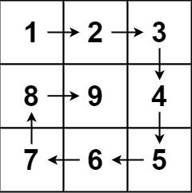
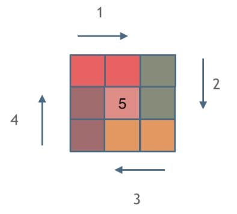

>


---

### 例1.[螺旋矩阵 II（59）-medium](https://leetcode.cn/problems/spiral-matrix-ii/)

#### 题目：
给你一个正整数 n ，生成一个包含 1 到 n2 所有元素，且元素按顺时针顺序螺旋排列的 n x n 正方形矩阵 matrix 。

示例1：  

```
输入：n = 3
输出：[[1,2,3],[8,9,4],[7,6,5]]
```

示例2：
```
输入：n = 1
输出：[[1]]
```

提示：

- 1 <= n <= 20

#### 思路：
绘制螺旋矩阵的思路就是依次循环绘制矩阵的四条边，需要注意每条边的边界条件，这里采用**左闭右开**原则：  


#### 解法：
观察可知：对于正整数 n,需要绘制四条边共 Math.floor(n+1/2) 次；

#### 代码：

<!-- tabs:start -->

#### **JavaScript**

```javascript
/**
 * @param {number[]} nums
 * @return {number[]}
 */
var sortedSquares = function(nums) {
    //类似归并排序，定义两个指针求解（非快慢指针）
    //先计算出平方后的数组
    let a=[];
    for(let i = 0;i<nums.length;i++){
        nums[i]=nums[i]*nums[i];
    }
    i=nums.length-1;
    //两个指针分别指向数组首尾，然后往中间逼近
    for(let j = 0;j<=i;){
        if(nums[j]>=nums[i]){
            a.push(nums[j]);
            j++;
        }
        else{
            a.push(nums[i]);
            i--;
        }
    }
    return a.reverse();
};
```

#### **Java**

```
System.out.println("Hello World");
```

#### **Python**

```
print('Hello World')
```

<!-- tabs:end -->

---